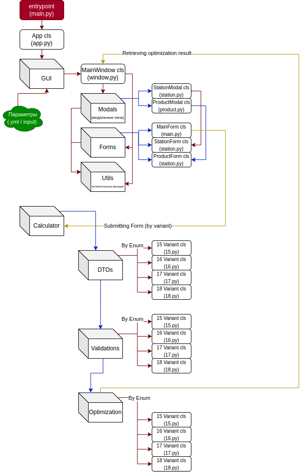

# optimization-practice

TODO legend:
- `todo`: minor todos
- `TODO`: major todos:
  - `DEV-PRIOR`: development priority when you start working
  - `TEST-PRIOR`: testing priority after completed developing
  - `TEST-REGRESS`: parts that may need hard regress testing
  - `*Name*`: if a name is in such todo, it means that this person is needed to do something there

TODO examples:
- `todo: this project is shit`
- `TODO DEV-PRIOR: input parameters validation`
- `TODO Timur: try launching it in linux environment plz`

### Структура проекта
- Стрелочками обозначил откуда куда все идет
- Цвета стрелочек разные только, чтобы не путаться в пересечениях
- Округленный прямоуг. = файл
- Параллелепипед = питоновский модуль (который с \_\_init__.py)
- Вертикальные ряды = уровень вложения, т.е. первый ряд это корневая папка и т.д.
 

### WORK FLOW приложения:
1) Запускаемся с **entrypoint**'а приложения (`main.py`)
2) Entrypoint инициализирует **класс Приложения** (`App`)
3) **Класс Приложения** (`App`) инициализирует графический интерфейс с **Главным Окном** (`MainWindow`) и возможно делает что-то еще (например, логирование)
4) **Главное Окно** (`MainWindow`) отрисовывает **Главную Форму** (`MainForm`)
5) В Главной Форме (`MainForm`) есть:
   1) Dropdown селектор **"Выбор варианта"**
   2) Кнопка **"Загрузить данные из файла"** (*)
   3) **3 кнопки** для открытия **Модальных Окон Оборудования** (`StationModal`), которые отрисовывают **Форму Оборудования** (`StationForm`)
   4) **5 кнопок** для открытия **Модальных Окон Изделия** (`ProductModal`), которые отрисовывают **Форму Изделия** (`ProductForm`)
   5) **Дополнительные поля** (например, поле для заполнения минимального дохода для 17-ого варианта)
    * (\*) - После загрузки данных из файла значения из **ВСЕХ** форм заполняются автоматически кроме выбора варианта
6) В **Форме Оборудования** (`StationForm`) есть:
   1) Поле **Фонд Времени** (`time-fund`)
   2) Поля **Временных Затрат** для каждого продукта (`time-cost-i`), где i от 1 до 5
7) В **Форме Изделия** (`ProductForm`) есть:
   1) Поле **Минимального Количества** изделия (`min`)
   2) Поле **Стоимости** изделия (`cost`)
8) После заполнения **Главной Формы** (`MainForm`) и остальных отправляется submit на вычисление задачи по оптимизации
9) Из модуля **Calculator** вытаскивается соответствующая `DTO` по варианту и в нее запихиваются данные из формы
10) После `DTO` отправляется на **Валидацию** (`Validation`) по соответствующему варианту:
    1) Если **Валидация** неуспешная, то отлавливается ошибка и отправляется обратно в **Главное Окно** (`MainWindow`)
    2) Иначе программа продолжает свою работу
11) После успешной **Валидации** `DTO` передается в соответствующий по варианту Алгоритм Оптимизации (`Optimization`)
12) Алгоритм Оптимизации (`Optimization`) высчитывает все и по хорошему выплевывает следующее:
    * Необходимые данные, чтобы отрисовать их в **Главном Окне** (`MainWindow`)
    * Графики **Зависимости Оптимизации** от каких-либо переменных (как у вариантов 17, 18...)